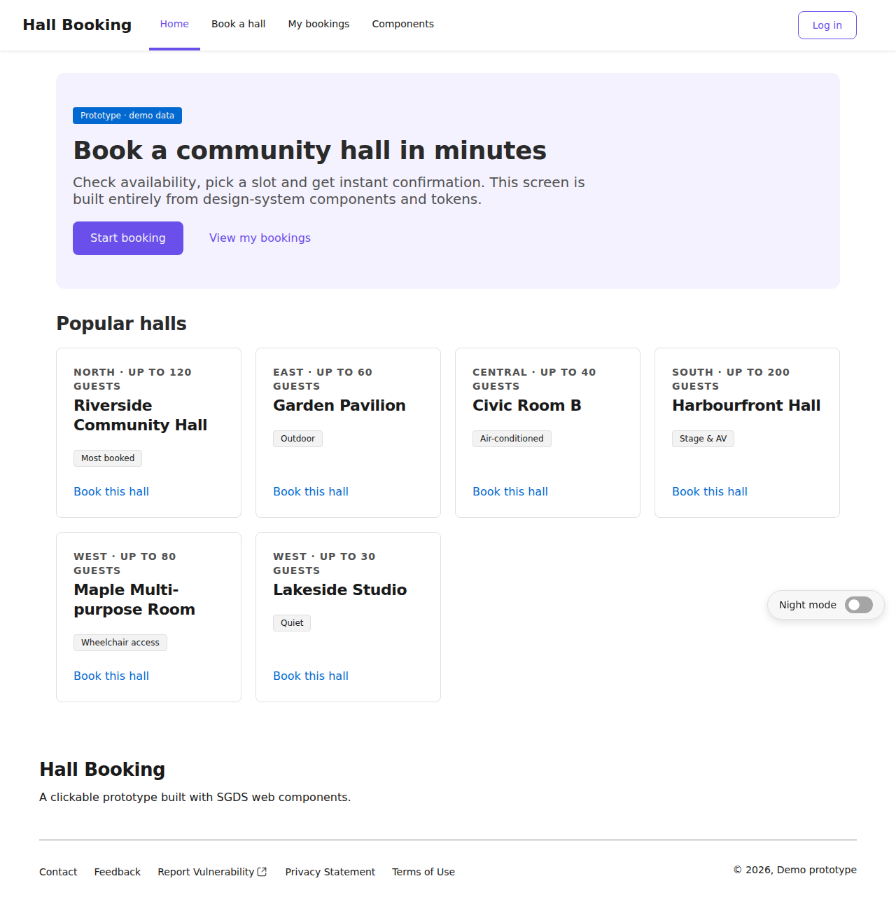
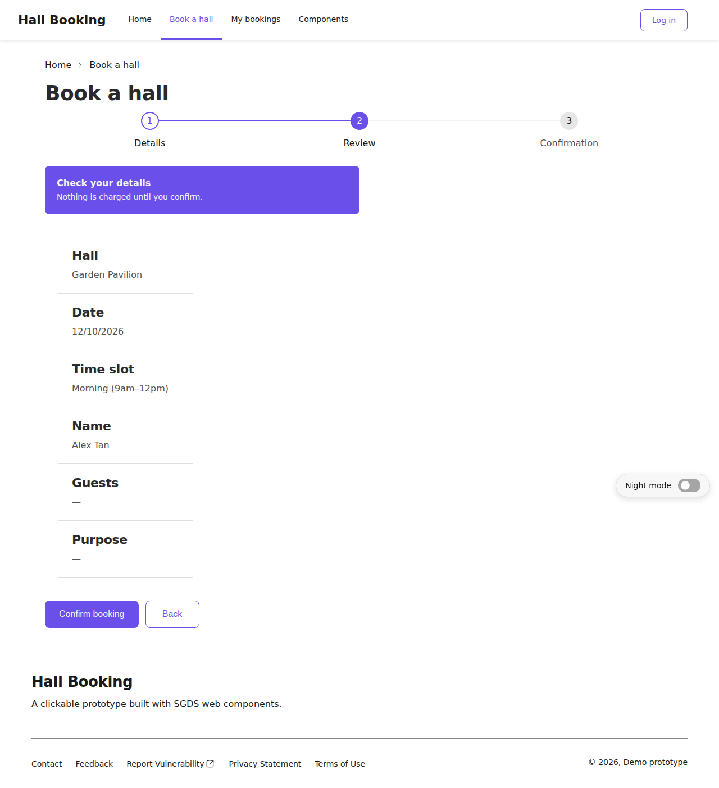
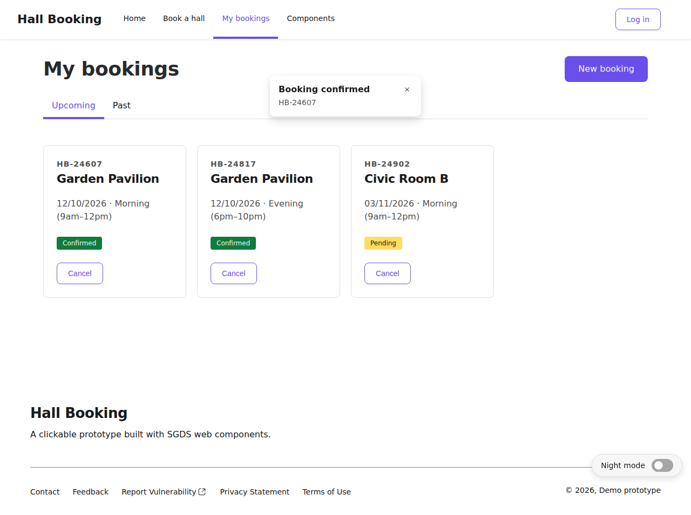
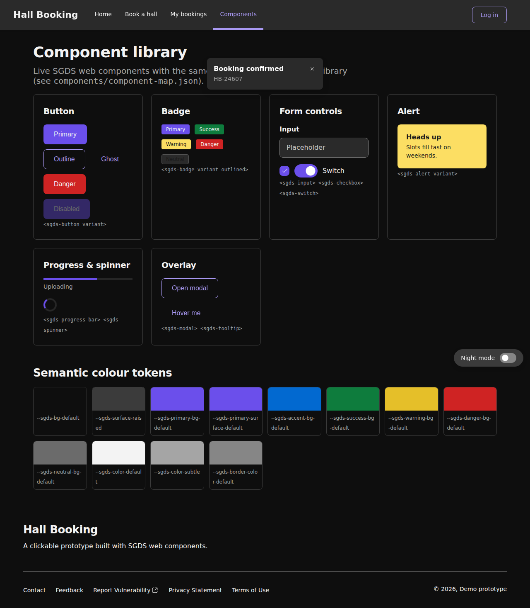

# SGDS Design System (code + Figma bridge)

This folder is a working copy of the **Singapore Government Design System (SGDS)** — https://www.designsystem.tech.gov.sg/ — built from its official open-source package
[`@govtechsg/sgds-web-component@3.29.0`](https://www.npmjs.com/package/@govtechsg/sgds-web-component) (MIT licence).
It has three parts:

| Folder | What it is | Used for |
|---|---|---|
| `tokens/` | Design tokens in W3C DTCG JSON, generated from SGDS's own CSS variables | **Importing into Figma as Variables** so the Figma library and the code share the same values |
| `components/component-map.json` | All 80 `sgds-*` components with their props, slots and events, plus an empty `figma` field for each | **Mapping code components to Figma components** (fill in the node URL or key) |
| `prototype/` | A clickable code prototype (HTML + SGDS web components) | Stakeholder review, and a reference showing how the components fit together |

> ⚠️ This is a clone for prototyping. The prototype deliberately leaves out `sgds-masthead` and the Singapore Government crest, and uses a fictional service with demo data. Before you use it on a real government service, follow SGDS's rules on identity and branding.

---

## 1. Tokens → Figma Variables

Generated files (collection → modes):

| Figma collection | File(s) | Modes | Count |
|---|---|---|---|
| **Primitives** | `primitives.tokens.json` | — | 351 |
| **Responsive** | `responsive.mobile / tablet / desktop.tokens.json` | Mobile (<1024), Tablet (≥1024), Desktop (≥1440) | 63 |
| **Semantic** | `semantic.day / night.tokens.json` | Day, Night | 163 |

- Semantic and Responsive tokens are **aliases** to Primitives, e.g. `bg.default → {palette.gray.000}`. The build script checks that every alias resolves.
- The `$description` of each token holds the CSS variable name it came from (for example `--sgds-bg-default`), so Figma and code always refer to the same thing.
- Dimensions are converted to px numbers (1rem = 16px). Figma Variables can't hold shadows, gradients, easing or duration, so these are listed in `tokens/skipped.txt` instead. In Figma, make them into Effect/Paint Styles.

**How to import:**
1. **Tokens Studio for Figma** (recommended): Import the JSON files as token sets, then run *Create Variables*. Map each file to a collection and mode as in the table above.
2. **Figma native** (Local variables → Import): Import `primitives` first, then import each mode file into the Responsive and Semantic collections.

## 2. Linking to the Figma library

The best starting point is the **official SGDS Figma library** (SGDS publishes it on Figma Community). Duplicate it into your team and publish it as a library.

1. Import the tokens (step 1). Then bind the variables to the library's components, or check that their names already match.
2. For each component in `components/component-map.json`, fill in:
   ```json
   "figma": { "componentName": "Button", "nodeUrl": "https://www.figma.com/design/<file>?node-id=…", "componentKey": "…" }
   ```
   This file works as the source for Figma Code Connect, and for the DS governance skills in this repo.
3. When SGDS releases a new version, bump `SGDS_VERSION` in `scripts/build-tokens.mjs` and run it again. The resulting git diff shows exactly which tokens and components changed.

```bash
node scripts/build-tokens.mjs            # fetches the pinned package with npm pack, then regenerates everything
node scripts/build-tokens.mjs ./package  # or point it at a package you've already extracted
```

## 3. Code prototype

Open `prototype/index.html` in a browser (it loads SGDS from jsDelivr, pinned to 3.29.0). No build step is needed.

The flow: **Home → Book a hall (Stepper: Details → Review → Confirmation) → My bookings (Tabs, Cards, Modal to cancel) → Components gallery**. There's also a Day/Night switch at the bottom right.

Components used: mainnav, breadcrumb, stepper/step, select, datepicker, radio-group, input, textarea, checkbox, button, alert, description-list, card, badge, link, tab-group, table, modal, toast, tooltip, switch, progress-bar, spinner, footer.

| Home | Review step | My bookings | Components (Night) |
|---|---|---|---|
|  |  |  |  |

To build a new screen, copy one of the `<section class="view">` blocks, add a link to it in `sgds-mainnav`, and use only `sgds-*` components and `var(--sgds-*)` tokens. That keeps every screen consistent with the Figma library.
